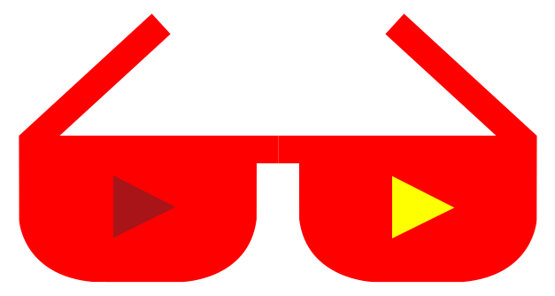

<!--lint disable double-link-->
<!--lint disable awesome-heading-->

  	<h1>
    	Awesome Spanish YouTubers
		
  	</h1>
	 
	

		
	

> Mira tutoriales de YouTubers que enseñan sobre tecnología.

## Otros idiomas

Este repositorio solo enumera increíbles YouTubers que hablan español. Los colaboradores increíbles han creado sus propias listas de YouTubers tecnológicos increíbles en otros idiomas. **A continuación puede ver todos los repositorios enumerados.** Si crees que tienes increíbles YouTubers en un idioma específico y tienes al menos algunos de ellos, puedes crear tu propia lista y hacérnoslo saber [abriendo un ticket en el repositorio principal en inglés](https://github.com/JoseDeFreitas/awesome-youtubers/issues/new).

-   [Inglés](https://github.com/JoseDeFreitas/awesome-youtubers)
-   [Portugués brasileño](https://github.com/rcarubbi/awesome-brazilian-youtubers)

## Índice

- [Programación general](#programación-general)
- [Desarrollo Web](#desarrollo-web)
  - [Frontend](#frontend)
  - [Backend](#backend)
- [Ciencia de la computación](#ciencia-de-la-computación)
- [Machine learning](#machine-learning)
- [DevOps](#devops)
- [Desarrollo de Juegos](#desarrollo-de-juegos)
- [Desarrollo móvil](#desarrollo-móvil)
- [Desarrollo embebido](#desarrollo-embebido)
- [La seguridad cibernética](#la-seguridad-cibernética)
- [Internet/redes](#internetredes)
- [Software en general](#software-en-general)
- [Sistemas Operacionales](#sistemas-operacionales)
- [Diseño digital](#diseño-digital)
- [Audio y video](#audio-y-video)
- [Hardware](#hardware)
- [Programación competitiva](#programación-competitiva)
- [Life skills](#life-skills)

## Programación general

Hay muchos lenguajes de programación en el mercado. En esta sección, encontrará muchos de ellos, incluidos Python, C, Java. Incluso, muchos YouTubers enseñan sobre los marcos de estos lenguajes. No solo lenguajes de programación, sino también otros temas relacionados con la programación. Puedes encontrar tutoriales tanto prácticos como teóricos.

[**CraterMaik**](https://www.youtube.com/c/CraterMaik)  \
Contenido sobre: Discord.js \
Listas de reproducción destacadas: `DISCORD BOT MODULAR`, `Discord BOT | Desarrollo`, `Tutoriales Discord 2020`. \
 

[**John Ortiz Ordoñez**](https://www.youtube.com/c/JohnOrtizOrdo%C3%B1ez)  \
Contenido sobre: Python, Java, Ejercicios de programación \
Listas de reproducción destacadas: `Python - Ejercicios`, `Java - Ejercicios`, `playlists de Numpy`, `Pandas - Ejercicios`, `muchas más playlists`.

[**Fazt Code**](https://www.youtube.com/c/FaztCode)  \
Contenido sobre: Frontend, Backend \
Listas de reproducción destacadas: `Node.js playlist`, `videos de API/REST API`, `frameworks de JavaScript`, `Node.js & Mongodb CRUD 2.0`, `otros videos relacionados`.

[🔼 Volver al índice](#índice)

## Desarrollo Web

El desarrollo web comprende el desarrollo frontend: desde los más básicos (HTML, CSS y JavaScript) hasta los frameworks más modernos (React.js, Vue.js, Angular). También incluye temas de desarrollo de back-end como Node.js, GraphQL, SQL y cosas más básicas como DNS, URL e implementación. También puedes encontrar oportunidades laborales como desarrollador web y otras cosas relacionadas.

### Frontend

[**Bluuweb !**](https://www.youtube.com/c/Bluuweb)  \
Contenido sobre: Frontend, Backend \
Listas de reproducción destacadas: `Curso de Vue.js`, `Curso de CSS3 y Flexbox Completo`, `Bootstrap 4 Curso Completo`, `videos de JavaScript y React.js`, `Curso Firebase / Firestore desde cero 💪`.

[**Codificandolo**](https://www.youtube.com/c/ManuelMuñozMir)  \
Contenido sobre: Frontend, Backend \
Listas de reproducción destacadas: `APRENDE JAVASCRIPT | BOOTCAMP FULL STACK JAVASCRIPT`, `REACT.JS`, `JAVASCRIPT AVANZADO`, `Programación PHP`, `VUE + FIREBASE`.

[**Soy Dalto**](https://www.youtube.com/c/soydalto)   \
Contenido sobre: HTML, CSS, JavaScript, Frontend \
Listas de reproducción destacadas: `Curso de DISEÑO WEB desde CERO (Completo)`, `Cursos de Desarrollo Web desde CERO (Completos)`, `Aprende a PROGRAMAR (Desde Cero)`.

### Backend

[🔼 Volver al índice](#índice)

## Ciencia de la computación

Los principales conceptos de informática se pueden encontrar aquí. Algunos canales enseñan sobre operaciones matemáticas, incluidas varias listas de reproducción con diferentes temas matemáticos. Lo mismo ocurre con los temas de matemáticas y física altamente relacionados con las computadoras y el hardware. Perfecto si quieres conocerlo con más profundidad.

[**Memorias de un Informático**](https://www.youtube.com/c/memoriasdeuninformatico)  \
Contenido sobre: Cursos sobre electrónica, linux y proyectos. \
Listas de reproducción destacadas: `Curso ARM desde 0`, `Personalización de Linux`, `Curso de electrónica`. \
 

[🔼 Volver al índice](#índice)

## Machine learning

Encuentre YouTubers experimentados en aprendizaje profundo, procesamiento de lenguaje natural, redes neuronales y muchos otros temas relacionados con esta amplia categoría. Una cosa buena de Machine Learning es que se puede aplicar usando diferentes lenguajes de programación, y los conceptos fundamentales tienen la misma estructura para diferentes lenguajes.

[**Ringa Tech**](https://www.youtube.com/c/RingaTech)  \
Contenido sobre: Inteligencia artificial, Redes neuronales \
Listas de reproducción destacadas: `Inteligencia Artificial`, `Inteligencia Artificial desde cero con Python y Tensorflow`, `Visión artificial`.

[🔼 Volver al índice](#índice)

## DevOps

DevOps es la combinación de desarrollo de software (software **dev**elopment) e infraestructura (IT **op**eration**s**). Esta lista contiene algunos YouTubers que facilitan el aprendizaje del tema de DevOps. Los temas pueden incluir Docker, Kubernetes, Diseño de sistemas, Kafka, Ansible, Cassandra, Zookeeper, Hadoop, Cloud (AWS, GCP, Azure), etc.

[🔼 Volver al índice](#índice)

## Desarrollo de Juegos

Este es un tema amplio. En esta sección encontrarás YouTubers que enseñan sobre plataformas de desarrollo de juegos (Unity, Unreal Engine, etc.), conceptos fundamentales en diferentes lenguajes de programación (JavaScript, HTML5, Java), creación/diseño de arte, modelado 3D y mucho más.

[🔼 Volver al índice](#índice)

## Desarrollo móvil

En estos días, no podemos imaginar nuestras vidas sin nuestros teléfonos inteligentes y las personas que hacen posible nuestra experiencia con teléfonos inteligentes son los desarrolladores de aplicaciones móviles. En esta sección, puede aprender cómo desarrollar aplicaciones móviles orientadas al consumidor desde cero. Aprenda a seguir las buenas prácticas de mercado. Aprenda Kotlin o Swift para el desarrollo nativo de Android/iOS o aprenda tecnologías como React Native y Flutter para el desarrollo móvil multiplataforma.

[🔼 Volver al índice](#índice)

## Desarrollo embebido

El área de sistemas embebidos comprende software creado específicamente para controlar ciertos dispositivos microcontroladores. En esta sección encontrarás tutoriales para aprender Arduino, Raspberry Pi, PIC y otros microcontroladores.

[🔼 Volver al índice](#índice)

## La seguridad cibernética

La seguridad es algo que debería preocuparnos a todos. Aprenda a protegerse de ataques o software malicioso. También aprenda cómo se hacen los hacks para comprender profundamente lo que sucede dentro de ellos con tutoriales de hacking ético.

[🔼 Volver al índice](#índice)

## Internet/redes

Conectarse a Internet y las redes es un tema muy amplio, y es común quedarse atascado cuando estamos estudiando al respecto. Obtenga increíbles listas de reproducción y videos sobre software y hardware para comprender cómo funcionan las redes y la conexión a Internet. Cómo configurar correctamente un módem/enrutador y qué son las IP, DNS y más.

[🔼 Volver al índice](#índice)

## Software en general

Es posible que los usuarios de YouTube que figuran en esta categoría no sean tutoriales de programación o tarjetas de diseño geniales, sino otro software y aplicaciones útiles que todos usan a diario. Domine esta suite que usa ampliamente o aprenda más sobre los servicios específicos que una empresa le brinda.

[🔼 Volver al índice](#índice)

## Sistemas Operacionales

Incluye videos y tutoriales para el correcto manejo y comprensión de Windows, Linux, Mac y otros sistemas operativos. Obtenga información sobre comandos y configuraciones útiles para mantener su sistema actualizado y seguro. Comprenda cómo funcionan estos sistemas en detalle para que pueda controlarlos utilizando los mejores métodos.

[🔼 Volver al índice](#índice)

## Diseño digital

Los tutoriales de diseño web se enumeran en la [sección de desarrollo web](#desarrollo-web). Pero, por supuesto, el diseño digital es increíblemente grande, e incluye excelentes representaciones de fotografías y pinturas de personas famosas o videos promocionales llamativos. Obtenga el conocimiento sobre cómo hacer estas cosas y sea un profesional con programas de diseño.

[🔼 Volver al índice](#índice)

## Audio y video

Tutoriales sobre la creación de contenido de audio y video. Incluye amplios temas como diseño, animación, renderizado, hardware y más. Usando el mejor y más popular software para crear hermosas animaciones de video, canciones bien producidas y cosas relacionadas con estos temas.

[🔼 Volver al índice](#índice)

## Hardware

Procesadores, placas base, monitores, teclados, ratones, PC's/Notebooks y todo lo relacionado con el hardware. Aquí también se pueden encontrar módems y enrutadores, así como los últimos teléfonos celulares y otros dispositivos de alta tecnología. Obtenga recomendaciones y comparaciones de precio y calidad de estos productos.

[🔼 Volver al índice](#índice)

## Programación competitiva

Los procesos de contratación de la mayoría de las empresas implican desafíos de codificación. La programación competitiva es como un deporte que se juega en Internet donde los programadores compiten entre sí. La siguiente lista contiene algunos de los canales que puede seguir para perfeccionar sus habilidades de programación competitiva. 

[🔼 Volver al índice](#índice)

## Life skills

Tu lado profesional se puede fortalecer mientras miras estos tutoriales. Es importante saber cómo administrar su dinero y mantenerlo bajo control, así como consejos para conseguir el trabajo que desea o iniciar su propio negocio. Encuentre también procesos de selección para empresas de tecnología/diseño/programación.

[**HolaMundo**](https://www.youtube.com/c/HolaMundoDev)  \
Contenido sobre: Recomendaciones, Reseñas \
Listas de reproducción destacadas: `un montón de videos variados`. \
 

[🔼 Volver al índice](#índice)

	
Créditos

	Tenga en cuenta que esta <strong>no es</strong> una lista promocional de ninguna manera.
	 
	El estilo de la lista está muy inspirado en <a href="https://github.com/mhxion/awesome-discord-communities">awesome-discord-communities</a>, criado por <a href="https://github.com/mhxion">mhxion</a>. Este repositorio es una traducción <a href="https://github.com/JoseDeFreitas/awesome-youtubers">de esta lista</a> y tiene la intención de seguir el mismo estilo en este archivo, así como la fuente útil <a href="/badges/README.md">badges/README</a>.
	 
	El logotipo de awesome-spanish-youtubers y los íconos correspondientes en Badges/README fueron creados por <a href="https://github.com/JoseDeFreitas/">José De Freitas</a> y adaptados por <a href="https://github.com/rcarubbi/">Raphael Carubbi Neto</a>.
	 
	El archivo badges/README se creó sin seguir ningún framework de diseño, aunque <a href="/badges/logo.svg">el logo de awesome-spanish-youtubers</a> está inspirado en <a href="https://github.com/sindresorhus/awesome/blob/main/badges/logo.svg">el logo de awesome</a> y el logo de <a href="https://github.com/sindresorhus/awesome-nodejs/blob/master/badges/logo.svg">awesome-nodejs</a>. Los dos íconos de reproducción se crearon siguiendo el botón de reproducción del <a href="https://lh3.googleusercontent.com/z6Sl4j9zQ88oUKNy0G3PAMiVwy8DzQLh_ygyvBXv0zVNUZ_wQPN_n7EAR2By3dhoUpX7kTpaHjRPni1MHwKpaBJbpNqdEsHZsH4q">logotipo de YouTube</a>. Es solo una representación, no estoy usando el logotipo de youtube en sí.
	

